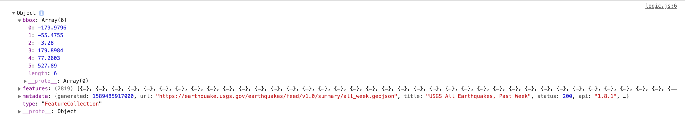
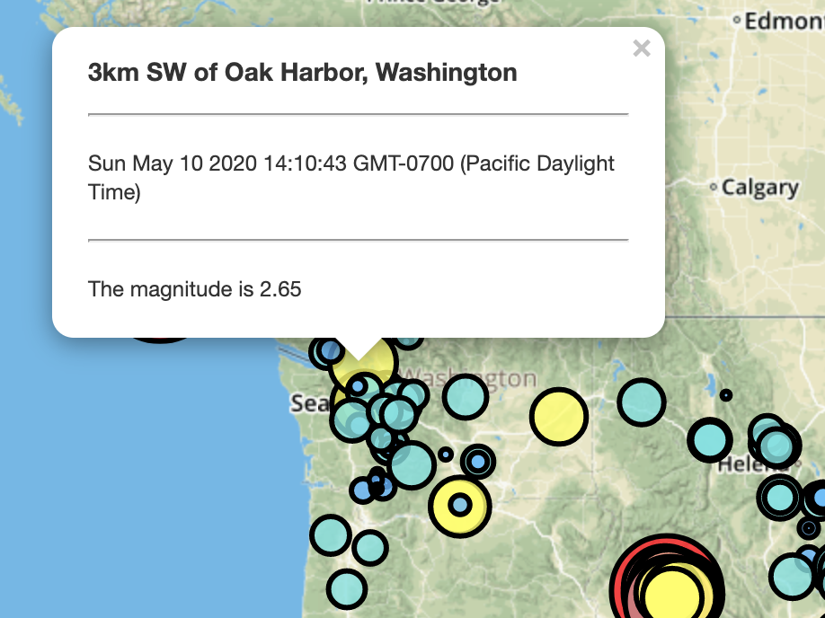

# Leaflet Challenge - Visualizing Data with Leaflet

## Background - Leaflet Challenge

Welcome to the United States Geological Survey, or USGS for short! The USGS is responsible for providing scientific data about natural hazards, the health of our ecosystems and environment; and the impacts of climate and land-use change.

From the [USGS GeoJSON Feed](http://earthquake.usgs.gov/earthquakes/feed/v1.0/geojson.php), I used the URL of this JSON to pull in the data for the visualization.  

Then, I created a map using Leaflet that plots all of the earthquakes from your data set based on their longitude and latitude. 

It included popups that provide additional information about the earthquake when a marker is clicked and the data markers reflect the magnitude of the earthquake in their size and color. Earthquakes with higher magnitudes should appear larger and different colors.

